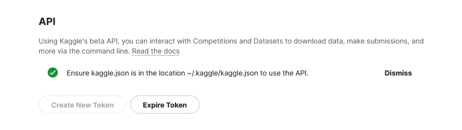

## Predicting a song's popularity on Spotify.

The dataset used for this project is located [here](https://www.kaggle.com/datasets/amitanshjoshi/spotify-1million-tracks). 

I have put the dataset in a GCS bucket. In order for you to do the same you have to follow these steps:

1. Make sure you setup gcloud on your machine by running: `gcloud init`

2. Make sure to have a python environment activated and install kaggle using pip: `pip install kaggle`. We will need kaggle to download the dataset programmatically.
    - To download datasets from kaggle programmatically, we need a kaggle API, which you can get from the settings page on kaggle.
    
    - Create a .kaggle folder in your machine's main directory: `mkdir ~/.kaggle`
    - Download the json file from kaggle and put it in the newly created .kaggle folder. 
    - Change the privacy of the file: `chmod 600 ~/.kaggle/kaggle.json`
3. From the directory `download_data` run
```
make load_to_bucket dataset=amitanshjoshi/spotify-1million-tracks bucket=spotify-popularity-prediction-inri
``` 

This script will download the dataset and upload it to the bucket. 

*Note: The gcs bucket has been created using the ui because it will only be created once.*

4. Please cd into the `mlflow_server` folder. There you will find the terraform `main.tf` and `variables.tf` files. Please run the following commands in order to set up a Google Cloud Platform (GCP) Virtual Machine (VM), a PostgreSQL database instance and a Google Cloud Storage (GCS) bucket. The database will serve as the backend of MLFlow, the VM will be used to run the server, while the bucket will be used to store the artifacts.
```
terraform init
terraform plan
terraform apply
```