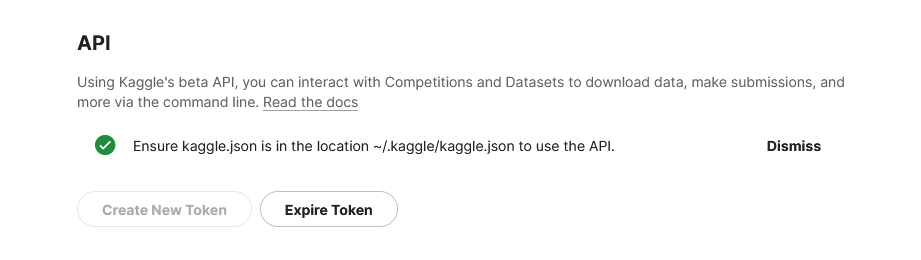
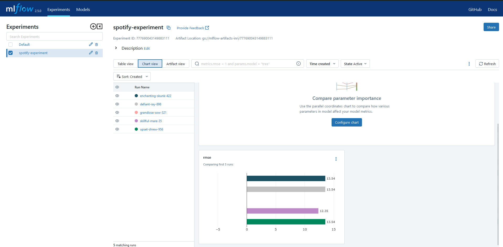
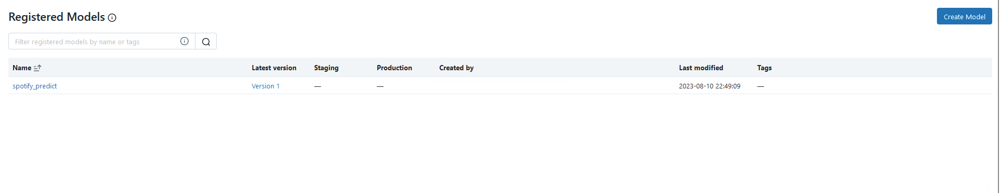
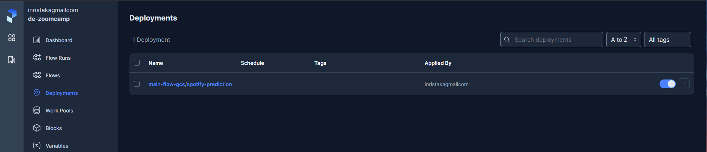

## Predicting a song's popularity on Spotify.

The dataset used for this project is located [here](https://www.kaggle.com/datasets/amitanshjoshi/spotify-1million-tracks). The idea behind this project was to create a REST API which can predict how successfull a song will be on Spotify if we provide some techincal details about the song. Such technical details include genre, danceability, energy etc. 

The api endpoint is located here: `https://spotifypredictapi-dbtolisexq-ew.a.run.app/predict`. In order to test it please send a request to this endpoint structured like this:
```
song_features = {
    "danceability": 0.5,
    "energy": 0.5,
    "loudness": 0.5,
    "speechiness": 0.5,
    "acousticness": 0.5,
    "duration_minutes": 3,
    "valence": 0.5,
    "tempo": 0.5,
    "liveness": 0.5,
    "genre": 1,
}
```
The endpoint is live so you can try it and it should work. There is a python file `rest_api/test_google_run_actions.py` which you can run to send the request as well. 
I have put the dataset in a GCS bucket. In order for you to do 
the same you have to follow these steps:


### Authentication

1. Make sure you setup gcloud on your machine by running: `gcloud init`

### Downloading the data and storing it in a Google Storage Bucket (GCS).

2. Make sure to have a python environment activated and install kaggle using pip: `pip install kaggle`. We will need kaggle to download the dataset programmatically.
    - To download datasets from kaggle programmatically, we need a kaggle API, which you can get from the settings page on kaggle.
    
    - Create a .kaggle folder in your machine's main directory: `mkdir ~/.kaggle`
    - Download the json file from kaggle and put it in the newly created .kaggle folder. 
    - Change the privacy of the file: `chmod 600 ~/.kaggle/kaggle.json`
3. From the directory `download_data` run
```
make load_to_bucket dataset=amitanshjoshi/spotify-1million-tracks bucket=spotify-popularity-prediction-inri
``` 

This script will download the dataset and upload it to the bucket. Please make sure the account you are authenticated as has the rights to access and write to the bucket.

*Note: The gcs bucket has been created using the ui because it will only be created once.*

### MLFlow server

4. Please cd into the `mlflow_server` folder. There you will find the terraform `main.tf` and `variables.tf` files. Please run the following commands in order to set up a Google Cloud Platform (GCP) Virtual Machine (VM), where MLFlow will be running.
```
terraform init
terraform plan
terraform apply
```
The output of terraform will be the external IP of the newly created VM. To login to the MLFlow server which is running in the newly created VM just go inside a browser and type inside the URL box:

`<VM-EXTERNAL-IP>:5000 #for example http://23.37.165.44:5000`

For authenticating, please use `admin` for the username and `password` for the password.

### Prefect

5. Inside the directory `prefect_deployment` there is a file called orchestrate_gcs.py. Inside this file you can find the code for the Prefect flow which will train a model and track it with MLFlow. You can either run it via `python orceshtrate_gcs.py` when you are inside the directory or you can also deploy a Prefect flow using Prefect Cloud.



The model is also deployed as a registered model in MLFlow.



The flow is deployed to Prefect Cloud for better automation.


### Rest API and Google Cloud Run

6. Inisde the directory `rest_api` you can find the code to deploy a REST API. 